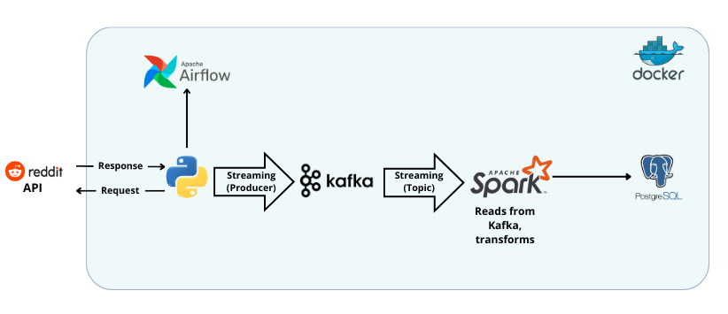

# Data Streaming Pipeline


This project is designed to stream data from the Reddit API (posts from the subreddit: r/TodayILearned) using Apache Kafka, consume and transform it using Apache Spark, and store the results in a PostgreSQL database. The entire workflow is containerized using Docker and orchestrated with Apache Airflow.


##  Pipeline Architecture




## Workflow:

1. **Kafka Producer**: Fetches new posts from `r/TodayILearned` via the Reddit API and publishes them to a Kafka topic.
2. **Spark Streaming Consumer**: Reads messages from Kafka and writes results to PostgreSQL.
3. **PostgreSQL Database**: Stores structured Reddit posts for further analysis.
4. **Airflow DAG**: Orchestrates the data pipeline, ensuring smooth execution.
5. **Docker & Docker Compose**: Manages all services for easy deployment.

### Setup & Deployment:
1. **Clone the Repository**:
   ```bash
   git clone https://github.com/zinebelbacha/reddit-data-streaming.git
   cd reddit-posts-streaming

2. **Install the dependencies**:
   ```bash
   pip install -r requirements.txt

3. **Create the airflow-kafka network:**
   ```bash
   docker network create airflow-kafka

4. **Start Kafka service:**
   ```bash
   docker compose up

5. **Create a table in Postgres:**
   ```bash
   python scripts/create_table.py

6. **Build the docker image for spark:**
   ```bash
   docker build -f spark/Dockerfile -t reddit-posts/spark:latest  .


3. **Start Airflow service:**
   ```bash
   docker compose -f docker-compose-airflow.yaml up